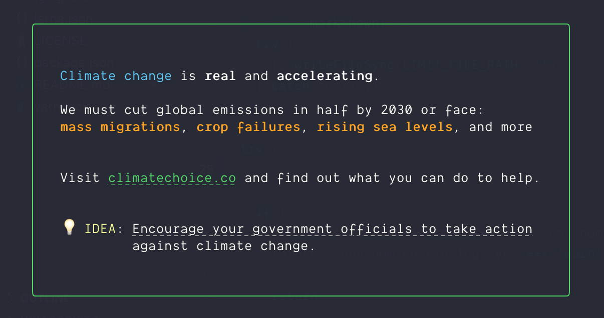

<h1 align="center">🌍🌏 <code>climate-change-reminder</code> 🌎🌍</h1>

<br>



<br>
<br>

> Help fight the climate change crisis by spreading the message for how you can help.

[](http://makeapullrequest.com)

## Usage

You can either add `use-climage-change-reminder` as a dependency like:

```shell
$ yarn add use-climage-change-reminder
```

or

```shell
$ npm install --save use-climage-change-reminder
```

to automatically print the message after installation.

Otherwise you can
import and call the function manually in your project:

```javascript
const climateChangeReminder = require('climate-change-reminder')

console.log(climateChangeReminder())
```
